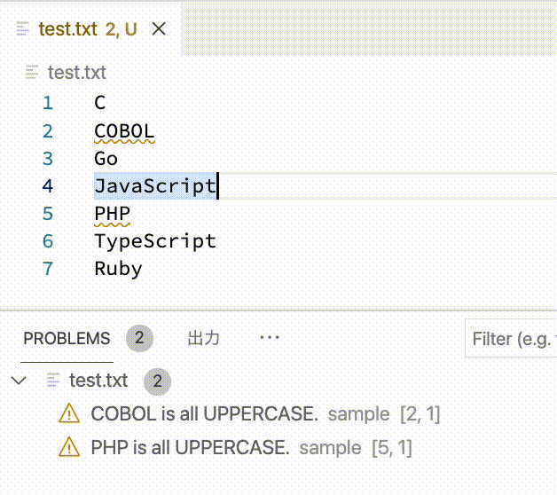
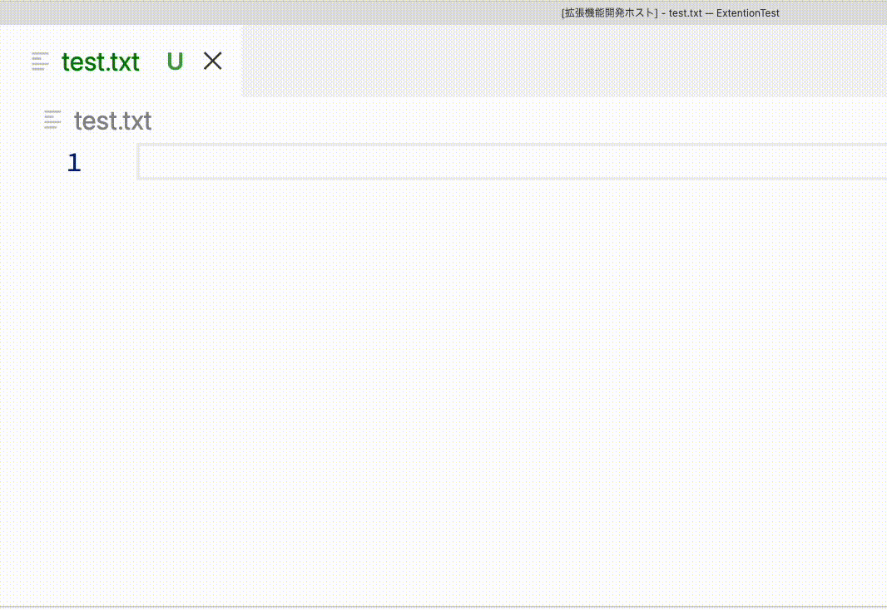

# Hello VS Code Extension ハンズオンテキスト

## ハンズオンのターゲットレベル

### ターゲット

- VS Codeを一通り使える方 -> この体験で拡張機能を積極的に作ってみようと思えるようになる
- 拡張機能の開発経験がある方 -> VS Code拡張機能のコード検証/修正機能，補完機能の実装方法を体験する

### ターゲットにしない

- VS Codeの使い方を知りたい人 -> このハンズオンは *"拡張機能開発"* をサポートします

## 事前に準備していただきたいこと

**事前準備**を見て，VS Codeをインストールし，必要な開発環境を整えてください

## 進め方

- VS Code に初めて触られる方は、最初のところから、ご自身のスピードで進めてみてください。
- 各 Topic の内容を以下に記載していますので、できそうなところはスキップして、気になるところから進めていただいて構いません。
- 各 Topic 課題が設定されていますが、課題をクリアーしなければいけないことはありません。興味のある部分から進めていただければと思います。

## 内容がむずかしいと思ったとき

もしこのドキュメントの内容が難しすぎる場合，お気軽にYoutubeのコメントや[GitHub Discussions](https://github.com/vscodejp/handson-hello-vscode-extension/discussions)でご意見をお寄せください．
また，以下のリンクから基礎的な学習を行えます．

- [TypeScript](http://js.studio-kingdom.com/typescript/)
- [Npm パッケージ](https://qiita.com/dondoko-susumu/items/cf252bd6494412ed7847)

本ハンズオンではTypeScriptを利用していますが，あまり高度な機能は利用しないため，JavaScript，もしくは他の言語にふれたことがあれば大丈夫です．

## 参加についての心構え

- 拡張機能開発には多くのつまづきポイントがあります．操作で悩む所、よくわからないところがあれば、気にせず質問して下さい。
- 質問はYoutubeのコメントの他，本リポジトリの[Discussion](https://github.com/vscodejp/handson-hello-vscode-extension/discussions)からも受け付けています．
- 質問にはスクリーンショットも一緒に添付してもらえると回答しやすいです．

## コンテンツ

- [事前準備: 必要な開発環境を整えよう](./docs/00_prepare.md)
  - やってもらうこと: VS Code, Node.js 16.xx, Git, Yeoman, ESLintをインストールする，GitHubアカウントを用意してもらう
  - 扱うこと: npmインストールを行う
  - ゴール: 必要な依存関係を揃えること

- [事前準備: LSPハンズオンの進め方](./docs/expert/00_codetour.md)
  - やってもらうこと: ハンズオンで利用する資料の使い方を確認する
  - 拡張機能インストール，CodeTourを起動する
  - ゴール: CodeTourを使えるようになる

- [予備知識: Language Server Protocol (LSP)とは？](./docs/expert/00_what_is_lsp.md)
  - やってもらうこと: 拡張機能開発の種類とLSPについて確認する
  - ゴール: LSPの利点や勉強方法を知る

- [必須: LSP拡張機能を作成しよう](./docs/expert/01_hello.md)
  - やってもらうこと: プロジェクトを作成する，プロジェクトを開く，プロジェクトを起動する
  - 扱うこと:git clone，フォルダを開く
  - ゴール: LSPの構造を理解する

- [コースA: ソースコード検証・修正機能を実装しよう](docs/expert/02_linter.md)
  - コード検証機能を実装しよう
    - やってもらうこと: LSPを使って3文字以上の大文字を検証する
    - 扱うこと: server.tsの編集，コード検証機能の編集
    - ゴール: エディタ上で該当文字を入力することで言語を検証する
  - コード修正機能を実装しよう
    - やってもらうこと: LSPを使って大文字を小文字に変える
    - 扱うこと: server.tsの編集，コード編集機能の実装
    - ゴール: 目的のリントツールが作成できること



- [コースB: 補完機能を実装しよう](./docs/expert/03_completion.md)
  - やってもらうこと: `Visual Studio Code`, `VS Code`の補完を行う
  - 扱うこと: server.tsを編集，補完機能の実装
  - ゴール: エディタ上で該当文字を入力することで補完を行う



### コースを完了した人向け

- [作成した拡張機能をインストールしよう](./expert/04_publish.md)
  - やってもらうこと: 拡張機能をパッケージ化し，インストールする
  - 扱うこと: `vsce package`
  - ゴール: 自分で作った拡張機能をインストールする

### 拡張機能の基礎を学びたい人向け

- [Hello Worldを作成しよう](./docs/beginner/01_init.md)
  - やってもらうこと: プロジェクトを作成する，プロジェクトを開く，プロジェクトを起動する
  - 扱うこと: vsce，フォルダを開く
  - ゴール: プレーンアプリを作成する

- [Hello Worldを起動しよう](./docs/beginner/02_build.md)
  - やってもらうこと: プロジェクトを作成する，プロジェクトを開く，プロジェクトを起動する
  - 扱うこと: vsce，フォルダを開く
  - ゴール: プレーンアプリを作成する

- [スニペットを追加しよう](./docs/beginner/03_snippet.md)
  - やってもらうこと: スニペットファイルを作って自動補完機能を作る
  - 扱うこと: スニペットファイルを作成，package.jsonを編集
  - ゴール: 顔文字や絵文字を一瞬で生成する

- [ドキュメントを編集しよう](./docs/beginner/04_edit.md)
  - やってもらうこと: コードレンズのボタンからドキュメントを編集する
  - 扱うこと: extension.ts，package.jsonを編集
  - ゴール: コードレンズのボタンからドキュメントを編集する

## 逆にこのコンテンツでは扱わないこと

- ウェブビュー
- キーバインド
- Webpack
- カラーテーマ
- マルチルート

## コントリビュータ向けガイド

- スクリーンショットは以下の環境で撮影する
  - .vscode/settings.json に設定済み
    - Color Theme: Light+(default light)
    - Icon Theme: VS Seti
    - Product Icon Theme: Default
  - Display Language: ja
- キーボードショートカットを紹介する場合には、macOS: Cmd+P、Windows・Linux: Ctrl+P と、Windows、macOS、Linux の各環境のキーバインドを書くようにする。

カスタマイズに影響を受けずに、このリポジトリを開くには以下のように cli で実行します。

```sh
code --extensions-dir ./tmp/extensions --user-data-dir ./tmp/user .
```
