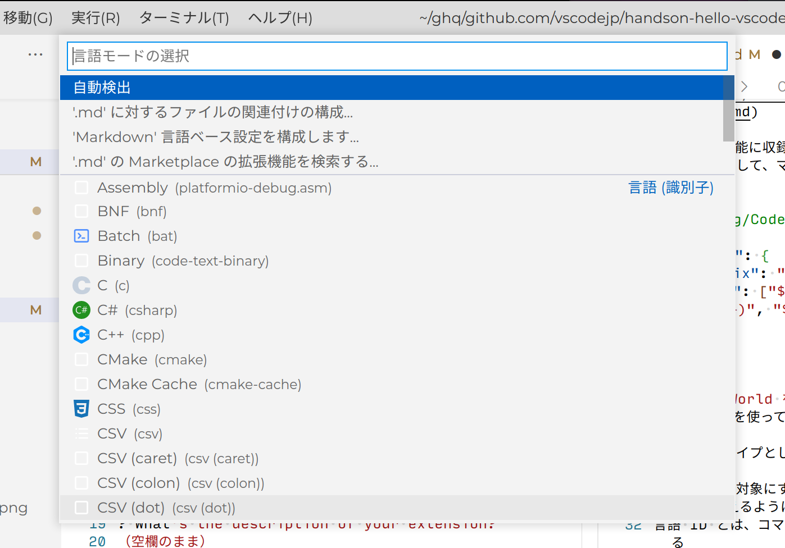
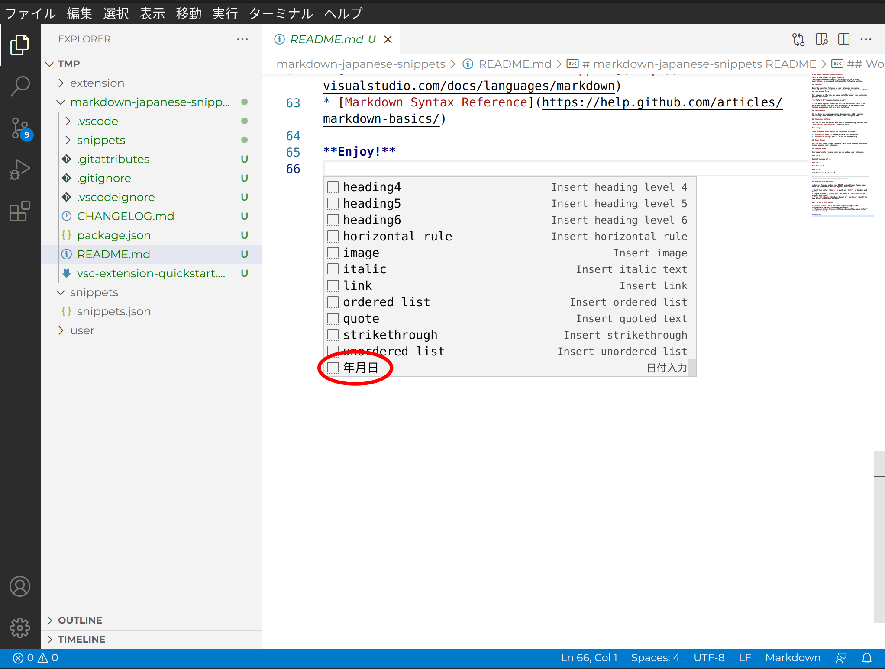

# スニペットを追加しよう

スニペットとは、コード中に差し込めるテンプレート機能のことです。
プログラミング言語やフレームワークなどのスニペットが、拡張機能として提供されています。

<https://marketplace.visualstudio.com/search?target=VSCode&category=Snippets&sortBy=Installs>

ここでは、スニペットの拡張機能の作り方について解説します。スニペットの基本的な使い方を知りたい場合は、Hello VS Code Handson でも、解説しています。

> Hello VS Code ハンズオンテキスト
> Topic 8 : スニペットで定型文を簡単に入力しよう
> [https://github.com/vscodejp/handson-hello-vscode/blob/master/topic8/README.md](https://github.com/vscodejp/handson-hello-vscode/blob/master/topic8/README.md)

まず、拡張機能に収録したいスニペットを作成します。
ここでは例として、マークダウンのスニペットを作成します。

```json
// .config/Code/User/snippets/markdown.json
{
  "日付入力": {
    "prefix": "年月日",
    "body": ["$1 年 $2 月 $3 日 (${4|月,火,水,木,金,土,日|})", "$0"]
  }
}
```

『[Hello World を作成しよう](./01_build.md)』 と同様に、Yeoman を使って拡張機能を作成します。

拡張機能のタイプとして`New Code Snippets`を選択します。

スニペットの対象にする言語 ID を指定します。指定した言語でスニペットが使えるようになります。
言語 ID とは、コマンド『言語モードの変更』を実行した時に表示される、()で囲われた識別子として表示される値です。



```sh
$ yo code

**拡張機能のタイプ**
? What type of extension do you want to create?
New Code Snippets
**TextMateのスニペットを読み込む場合の、TextMateのスニペットのディレクトリ**
? Folder name for import or none for new:? What's the name of your extension?
（空欄のまま）
**拡張機能の名前**
? What's the name of your extension?
Markdown Japanese Snippets
**拡張機能のID（全小文字）**
? What's the identifier of your extension?
markdown-japanese-snippets
**拡張機能の説明**
? What's the description of your extension?
（空欄のまま）
**スニペットが使える言語ID**
? Language id:
markdown
**gitリポジトリを作成するか**
? Initialize a git repository?
Yes
**拡張機能の開発に使うVS Codeのエディション**
? Do you want to open the new folder with Visual Studio Code?
Open with `code`
```

作成された拡張機能のプロジェクトでは、snippets というディレクトリを持っており、このディレクトリ内にスニペットの JSON ファイルを格納します。拡張子は code-snippets となっていますが、JSON 形式で入力します。

```
.
├── snippets
│   └─ snippets.code-snippets
└── package.json
```

```json
// snippets/snippets.code-snippets
{
  "日付入力": {
    "prefix": "年月日",
    "body": ["$1 年 $2 月 $3 日 (${4|月,火,水,木,金,土,日|})", "$0"]
  }
}
```

マニフェストファイル（package.json)の 拡張機能が作用するポイント（Contribution Points）である "contributes"."snippets" にこのスニペットファイルへのパスが書かれています。1 つのスニペットファイルには複数のスニペットを書くことができますが、複数の言語 ID に対応したり、ファイルを分けたい場合は、ここに追加で列挙します。

```json
{
    "name": "markdown-japanese-snippets",
    "displayName": "Markdown Japanese Snippets",
    "description": "",
    "version": "0.0.1",
    "engines": {
        "vscode": "^1.62.0"
    },
    "categories": [
        "Snippets"
    ],
    // Contribution Points
    "contributes": {
        "snippets": [
            {
                "language": "markdown",
                "path": "./snippets/snippets.code-snippets"
            }
        ]
    }
}
```

実際に拡張機能を実行して見るには、`F5`を押して、拡張機能を有効にした VS Code を起動させます。その起動した VS Code でマークダウンファイルを開き、Ctrl+Space（MacOS の場合、Cmd+Space）を押して、表示される補完の候補に先程追加した『年月日』が含まれていて、利用できることを確認しましょう。



## 課題 1

お好きなプログラミング言語を一つ選び、その言語で繰り返し命令（for 文）を入力するスニペットの拡張機能を作成してみましょう。
