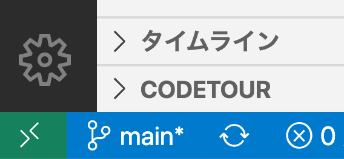

# コード補完機能を実装しよう

このドキュメントでは自動的にVS Codeと補完する機能を実装します．


## ブランチ切り替え

補完機能の実装用CodeTourを使うためには，ブランチを切り替える必要があります．
以下のコマンドを実行するか，エディタの左下のブランチ名`main`をクリックし，`origin/linter`を選んでください．

```sh
git checkout -b completions origin/completions
git checkout completions
```



## サーバー設定

```ts
connection.onInitialize((params): InitializeResult => {
    ...
    return {
        capabilities: {
            ...
            // Tell the client that the server supports code completion
            completionProvider: {
                resolveProvider: true
            }
        }
    };
});
```

## 補完機能部分の定義

それでは実際に補完機能を実装します．

まずは，ドキュメントを監視し，補完する文字列を定義します．
今回は`VS Code`，`Visual Studio Code`の２つを補完します．

```ts
function setupDocumentsListeners() {
	// ドキュメントを作成、変更、閉じる作業を監視するマネージャー
	documents.listen(connection);
	// 補完機能の要素リスト
	connection.onCompletion(
		(_textDocumentPosition: TextDocumentPositionParams): CompletionItem[] => {
			return [
				{
					// 補完を表示する文字列
					label: 'VS Code',
					// コード補完の種類、ここではTextを選ぶがMethodなどもある
					kind: CompletionItemKind.Text,
					// 補完リスト上でのラベル
					data: 1
				},
				{
					label: 'Visual Studio Code',
					kind: CompletionItemKind.Text,
					data: 2
				}
			];
		}
	);
}
```

次に`setupDocumentsListeners`の中でラベル付けされた補完リストの詳細を定義する関数を定義します．

```ts
    ...
	connection.onCompletionResolve(
		(item: CompletionItem): CompletionItem => {
			if (item.data === 1) {
				// 詳細名
				item.detail = 'VS Code 詳細';
				// 詳細ドキュメント
				item.documentation = 'VS Code 詳細ドキュメント';
			} else if (item.data === 2) {
				item.detail = 'Visual Studio Code 詳細';
				item.documentation = 'Visual Studio Code 詳細ドキュメント';
			}
			return item;
		}
	);
```

## 実際に使ってみる

## 機能をテストする

## 発展課題

* 好きな言語の補完機能を実装してみましょう．(package.jsonでの対応言語設定(`activationEvent`)を忘れないように)
  * 標準入力 (`int(input())`など)と標準出力 (print文など)を補完してみましょう．
  * 補完機能を実装したら，テストしましょう．
* （まだなら）[コースAのリンター機能](https://github.com/vscodejp/handson-hello-vscode-extension/blob/main/docs/expert/02_linter.md)を実装してみましょう．
